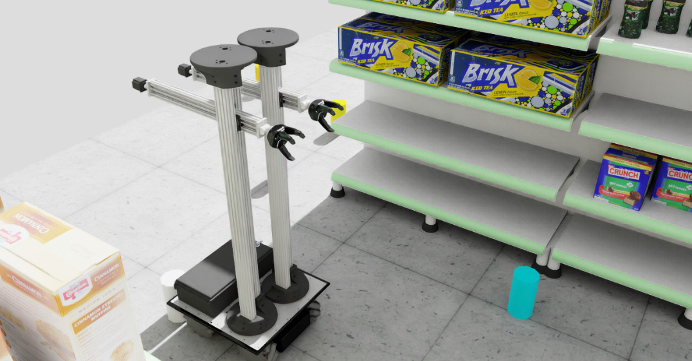
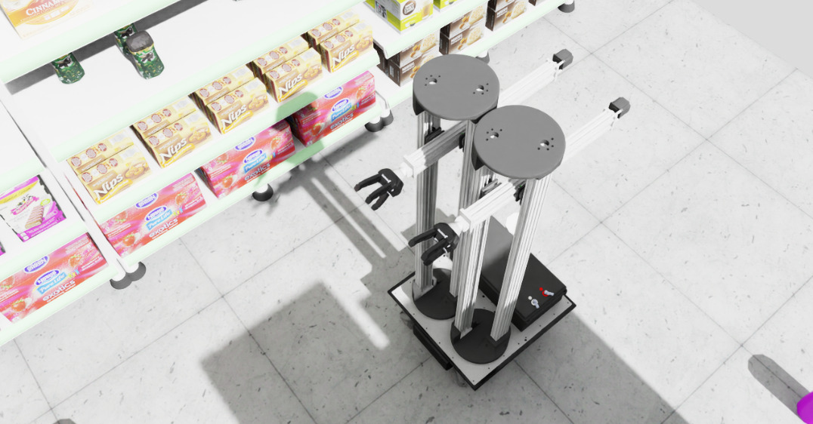
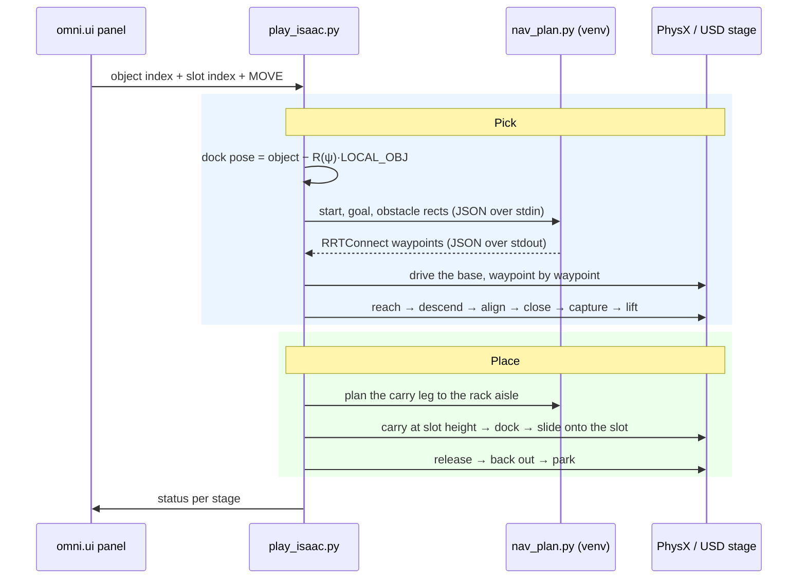

<h1 align="center">MORPH — Isaac Sim</h1>

<p align="center">
  <strong>Autonomous pick-and-place for the MORPH-I mobile manipulator, on NVIDIA Isaac Sim and PhysX.</strong>
</p>

<p align="center">
  
  
  
  
  
  
</p>

<p align="center">
  
</p>

<p align="center"><em>▶ Navigate to a scattered object, grasp it, carry it to the rack, and place it on an assigned shelf slot — one button.</em></p>

---

## ✨ Highlights

<table>
  <tr>
    <td align="center" width="33%">
      <strong>🌍 World — MJCF → OpenUSD</strong><br><br>
      <sub>A complete market scene — racks, shelves, textured products, marble floor — converted to a USD package and re-authored so it loads correctly under PhysX. Every converter artifact is a named, documented fixup.</sub>
    </td>
    <td align="center" width="33%">
      <strong>🤖 Robot — 98 DOFs, all controllable</strong><br><br>
      <sub>Mecanum base, dual parallel-linkage arms, two three-finger grippers. The closed kinematic loop a USD articulation cannot express is re-authored as a PhysX joint and held on its closure manifold every step.</sub>
    </td>
    <td align="center" width="33%">
      <strong>🚙 Base — OMPL planned</strong><br><br>
      <sub>RRTConnect <code>(x, y, yaw)</code> planning against the real rack footprints, with validated stand-off poses beside the target and a yaw-invariant dock.</sub>
    </td>
  </tr>
</table>

> **The physics is real, not staged.** The robot is a PhysX articulation stepped at 240 Hz. There are no scripted base transforms and no animation curves — navigation drives the mecanum base through the solver the way the hardware would be driven.

> **Closed-loop, not replayed.** The approach servos on the *measured* object pose, the close advances each finger on its *measured* pad load and gap, the shelf insert tracks the *measured* turret angle, and the placement height is corrected against the *measured* object height. Every stage that can drift has an instrument watching it and a guard that stops it.

> **Two grip modes.** `practical` welds the object once the grasp closes — it cannot slip, and it completes the full cycle to every shelf level. `perfect` holds the object on pad friction alone, which is what real hardware faces — the contact-physics development profile. See [Grip Modes](#-grip-modes).

> **The world is regenerable, not hand-built.** Everything in `usd/` is baked from the reference model by offline tooling, so scene changes flow through instead of being re-modelled by hand.

---

## 📑 Table of Contents

- [Quick Start](#-quick-start)
- [Run Your First Cycle](#-run-your-first-cycle)
- [Video Demos](#-video-demos)
- [Grip Modes](#-grip-modes)
- [How It Works](#-how-it-works)
- [Project Layout](#-project-layout)
- [Environment Variables](#-environment-variables)
- [Verifying a Run](#-verifying-a-run)
- [Reference Manual](#-reference-manual)
- [Troubleshooting](#-troubleshooting)
- [FAQ](#-faq)
- [Scope & Status](#-scope--status)
- [Acknowledgements](#-acknowledgements)

---

## 🚀 Quick Start

Two interpreters are involved, and it is worth being clear about why before installing anything.
Isaac Sim ships its own Python, and that is what runs the simulation. It has no OMPL bindings, so
the path planner runs as a subprocess in a **separate** Python 3.10 environment.

| Interpreter | Runs | Install |
| --- | --- | --- |
| Isaac Sim's bundled `python.sh` | `play_isaac.py`, `scene.py` | Comes with Isaac Sim — nothing to add |
| A Python 3.10 virtualenv | `nav_plan.py` (OMPL) | `requirements.txt` |

<details>
<summary><strong>1. Isaac Sim (required — install this first)</strong></summary>

> **Isaac Sim is a prerequisite, not a dependency of this repository.** It is a separate NVIDIA
> application: it is not bundled here and it cannot be installed with
> `pip install -r requirements.txt`. Nothing in this repository runs until Isaac Sim is on the
> machine.

Download the **Isaac Sim 6.0.1 standalone** Linux build from the
[NVIDIA Isaac Sim download page](https://developer.nvidia.com/isaac-sim) — the asset is
`isaac-sim-standalone-6.0.1-linux-x86_64`. Unpack it anywhere; everything below assumes:

```bash
export ISAAC=~/isaac-sim        # the unpacked folder, the one containing python.sh
```

Verify before going further:

```bash
"$ISAAC/python.sh" -c "import isaacsim; print('Isaac Sim OK')"
```

**Requirements**

| | |
| --- | --- |
| **Version** | **Isaac Sim 6.0.1** — the version this project is developed and tested against |
| GPU | RTX-capable NVIDIA GPU with a current driver — PhysX and RTX rendering both need it |
| OS | Ubuntu 22.04 |
| Disk | ~30 GB for Isaac Sim, plus room for the first-run RTX shader cache |

> **Why the version matters.** The scene is authored against the PhysX articulation and OpenUSD
> APIs shipped in the 6.0.x line. Other 6.0.x releases will most likely work; **4.x and 5.x will
> not** — several of the APIs used here were moved or renamed.
</details>

<details>
<summary><strong>2. The OMPL planner environment</strong></summary>

```bash
python3.10 -m venv .venv
.venv/bin/pip install -r requirements.txt
```

> **Why Python 3.10?** OMPL is distributed as a wheel compiled for specific Python versions, and
> those wheels are built against the NumPy 1.x ABI — hence the pinned `numpy==1.26.4`.

Verify:

```bash
.venv/bin/python3 -c "from ompl import geometric; print('OMPL OK')"
```
</details>

<details>
<summary><strong>3. Launch</strong></summary>

```bash
git clone https://github.com/obotx/nvidia-isaac-sim-openusd.git
cd nvidia-isaac-sim-openusd

./run_gui.sh
```

`run_gui.sh` points `OMPL_PYTHON` at `./.venv` and wraps the launch in a boot watchdog — Kit
occasionally deadlocks during initialisation after an abrupt exit, and a retry boots cleanly.
Override `ISAAC` if Isaac Sim is not at `~/isaac-sim`.

To launch without the wrapper:

```bash
OMPL_PYTHON=$PWD/.venv/bin/python3 "$ISAAC/python.sh" play_isaac.py
```

First launch takes a few minutes while Isaac compiles RTX shaders. Later launches are quick.
</details>

---

## 🎯 Run Your First Cycle

Once the viewport is up and the **MORPH Pick & Place** panel has appeared in the corner:

| # | Action | What you should see |
| :-: | --- | --- |
| **1** | **Wait** for the scene to finish loading | Market aisle, racks, textured products, ten cylinders scattered on the floor |
| **2** | **Check the arms** | Both held in the PARK pose, level and clear of the chassis — not sagging |
| **3** | **Choose an object** in the `Object` field | `0`–`9`, one per scattered cylinder |
| **4** | **Choose a shelf slot** in the `Shelf slot` field | `0`–`9`, labelled low / mid / high with their height in metres |
| **5** | **Press `MOVE`** | The terminal prints an `OMPL` plan and a waypoint count |
| **6** | **Watch the cycle** | Drive to the object → descend → close → lift → carry to the rack → dock → slide onto the slot → release → park |
| **7** | **Read the terminal** | Each stage prints a `>>>` line with the numbers behind it |

> 💡 **Tip:** Left-drag to orbit, right-drag to pan, scroll to zoom. Keeping the camera still
> during a run makes the planned path much easier to follow.

Headless, for a scripted run with no window:

```bash
ISAAC_HEADLESS=1 SEED=0 DEMO_CYCLES="3:6" \
  OMPL_PYTHON=$PWD/.venv/bin/python3 "$ISAAC/python.sh" play_isaac.py
```

`DEMO_CYCLES` takes a comma-separated list of `object:slot` pairs — `"3:6,0:1,5:8"` runs three
cycles back to back in a single boot.

---

## 🎥 Video Demos

### Full cycle

<https://github.com/user-attachments/assets/b31967ee-82f3-4f12-b48e-830361860bda>

*Navigate to the object, dock, descend, grasp, lift, carry to the rack, slide onto the slot, release, park.*

### Second run

<https://github.com/user-attachments/assets/dcd671bc-3bf1-4eb0-8ffc-51d0c965cc95>

*The same cycle against a different object and shelf slot.*

### Stills

<p align="center">
  
  &nbsp;
  
</p>

---

## 🎛 Grip Modes

The mode is chosen with `GRIP_MODE` and changes exactly one thing: **what holds the object once
the fingers have closed on it.** Navigation, docking, the descent, the alignment servos and the
close stroke are the same code in both.

| Mode | Launch | What holds the object | Status |
| --- | --- | --- | --- |
| **`practical`** *(default)* | `./run_gui.sh` | A PhysX `FixedJoint` weld, authored after the close completes. The grasp cannot slip. | ✅ Full cycle, all three shelf levels |
| **`perfect`** | `GRIP_MODE=perfect ./run_gui.sh` | Nothing but Coulomb friction between the pads and the object, for the whole lift and carry. | Contact-physics development profile |

> **Why both exist.** `practical` is the demonstrable pipeline: it exercises every planning,
> docking, alignment and placement stage end to end, and the weld makes the carry deterministic.
> `perfect` runs the same approach, alignment and close against pure Coulomb contact with no
> transport constraint — the profile used to develop and validate the grasp geometry (the pads
> land within a couple of millimetres of the surface on all three fingers). The carry is bounded
> by PhysX contact behaviour for the 1+2 asymmetric gripper on pad-on-cylinder line contact; the
> demonstrable end-to-end pipeline is `practical`.

> **On `FRICTION`.** The environment variable `FRICTION` is **not** a mode — it is the friction
> coefficient µ applied to the pad material in `scene.py`. The names are close and the meanings
> are unrelated.

---

## 🧠 How It Works

### Pipeline overview



### Component responsibilities

| Module | Role |
| --- | --- |
| `play_isaac.py` | Entry point. Boots `SimulationApp`, composes `Demo` from the mixins below, owns `main()`. Nothing else. |
| `scene.py` | Scene library. Loads the USD package, applies the load-time fixups below, sets drive gains, closes the arm linkage, applies the PARK pose. |
| `nav_plan.py` | The planner. Reads a JSON request on stdin, plans `(x, y, yaw)` with OMPL RRTConnect against inflated rack rectangles, writes waypoints to stdout. |
| `morph/config.py` | Sole owner of the scene constants, the reference grasp and the grip-mode selection. Every other module reads them from here. |
| `morph/geometry.py` | Pure quaternion and rotation maths. No Isaac dependency — run `python3 morph/geometry.py` for its self-check. |
| `morph/robot.py` | The write primitives: the base ledger, `set_base`, the joint command paths, the drive gains and the mecanum wheel mixer. Everything else calls these. |
| `morph/kinematics.py` | Frames, forward kinematics, the closure lookup table and the baked-trajectory player. |
| `morph/navigation.py` | OMPL path planning (a subprocess call) and the chassis drive that follows it. |
| `morph/world.py` | Object scatter, colliders, rack keep-outs, grip material. |
| `morph/align.py` | The alignment servos that bring the hand to the object without moving the object. |
| `morph/fingers.py` | Finger geometry and contact sensing: pad positions, surface gaps, joint reaction forces. |
| `morph/pick/` | The pick cycle, one module per stage: dock, reach, descend, close, grasp. |
| `morph/close/` | The finger close, one module per stage: replay, alignment, lowest-pose solve, enclose, joint servo, wrap, force balance, legal, seat. |
| `morph/place/` | Carry to the rack, slot insert, release, back out, and the failure recovery. |
| `morph/diagnostics.py` | Reporting only — measures and prints, never changes state. |
| `morph/gui.py` | The `omni.ui` side panel. |
| `usd/` | The baked world and the baked motion and geometry artifacts. |

### Design notes

> ⚙️ **Why the package is imported where it is.** Isaac's APIs come from plugins that only load
> once `SimulationApp` has been constructed, so `play_isaac.py` builds the app *before* it imports
> `morph`. Modules under `morph/` may therefore use Isaac APIs at module level; `config.py` and
> `geometry.py` deliberately do not, so they stay importable on their own. `smoke_test.py`
> enforces that ordering.

> 🧩 **Why the planner is a subprocess.** Isaac's bundled interpreter has no OMPL bindings, and
> OMPL's wheels are not built for it. Rather than vendor a planner or fight the ABI, the request
> is serialised to JSON and handed to a Python 3.10 process. It also keeps the planner
> engine-agnostic — the same module plans for the reference MuJoCo build unchanged.

> 🔩 **The arm is a closed kinematic loop.** Each arm is a four-bar parallel linkage. USD
> articulations are trees, so the loop-closing joint cannot live inside one. It is authored as a
> separate PhysX spherical joint marked `excludeFromArticulation`, and the passive links are held
> on the closure manifold each step from a baked table (`usd/_closure_lut.json`). This is why arm
> motion is replayed through configurations known to satisfy the closure rather than interpolated
> freely — interpolating off the manifold accumulates constraint error until the solver diverges.

> 🎯 **Docking is yaw-invariant.** The grasp configuration is a fixed arm pose, so the object
> always lands at the same point in the robot's base frame. Navigating to `P = O − R(ψ)·LOCAL_OBJ`
> facing `ψ` reproduces that geometry from *any* approach angle, which is what lets the planner
> choose the stand-off freely instead of being pinned to one side.

> 🪝 **The turret docks at zero.** The placement dock is chosen so the arm reaches the slot
> straight out in front of the robot rather than swinging across the chassis. The base absorbs the
> angle the turret would otherwise have to turn through, which keeps the working arm clear of the
> parked one without needing a collision check to catch it afterwards.

> 🩹 **Load-time fixups (`scene.py`).** The MJCF→USD converter leaves artifacts that make the
> scene unusable as imported. Each is undone at load so the source USD stays regenerable:
> **(1)** jointless world props import as *dynamic* bodies with bad mass and fall through the floor
> → their rigid-body dynamics are disabled; **(2)** inactive grasp welds import as *active* and
> snap every object onto the gripper at frame 0 → deleted; **(3)** the single source light does not
> convert, leaving a black RTX scene → a dome and a sun are added; **(4)** the marble floor texture
> is mapped once and stretched instead of tiled → an explicit tiled quad is authored;
> **(5)** link masses and inertias are dropped → restored from `usd/_link_masses.json`;
> **(6)** the arm sags into the chassis without its linkage equality → the PARK keyframe is applied
> and the loop joint is authored.

---

## 📁 Project Layout

```
nvidia-isaac-sim-openusd/
├── README.md                   # this file
├── requirements.txt            # OMPL planner environment (Python 3.10)
├── run_gui.sh                  # windowed launch with the Kit boot watchdog
├── play_isaac.py               # entry point — bootstrap, Demo composition, panel, main()
├── scene.py                    # scene library — USD load, fixups, gains, PARK pose
├── nav_plan.py                 # OMPL RRTConnect base planner (runs in the venv)
├── smoke_test.py               # fast structural checks, no GPU needed
├── verify_place.py             # verify a place run from its log (const-Z, upright, clearance)
├── assets/                     # screenshots and demo recordings used by this README
├── morph/                      # the application package
│   ├── config.py                   # scene constants, reference grasp, grip mode (single owner)
│   ├── geometry.py                 # pure quaternion/rotation maths (self-checking)
│   ├── usd_utils.py                # stage/prim lookup
│   ├── robot.py                    # base + articulation write primitives, mecanum mixer
│   ├── kinematics.py               # frames, FK, closure LUT, trajectory player
│   ├── navigation.py               # OMPL planning + the chassis drive
│   ├── world.py                    # object scatter, colliders, keep-outs
│   ├── align.py                    # the alignment servos
│   ├── fingers.py                  # finger geometry and contact sensing
│   ├── diagnostics.py              # reporting only
│   ├── gui.py                      # the omni.ui panel
│   ├── pick/                       # the pick cycle, one module per stage
│   │   ├── dock.py                     # dock-angle search, navigation, pre-grasp pose
│   │   ├── reach.py                    # baked reach replay
│   │   ├── descend.py                  # settle + fine align
│   │   ├── close_anim.py               # the driven finger close
│   │   ├── grasp.py                    # seat, capture, verify, lift
│   │   ├── animate.py                  # the curl profile with a per-finger surface stop
│   │   └── prep.py                     # finger poses used around the close
│   ├── close/                      # the finger close, one module per stage
│   │   ├── replay.py                   # recorded-close replay
│   │   ├── enclose.py                  # enclose + gap-equalisation orchestration
│   │   ├── approach_align.py           # pre-close XY/Z alignment servos
│   │   ├── lowest.py                   # lowest-pose solves before the forward reach
│   │   ├── joint_servo.py              # constant-height joint-space forward reach
│   │   ├── wrap.py                     # the encompassing close
│   │   ├── force_balance.py            # per-finger close on measured pad force
│   │   ├── legal.py                    # vendor legal-range close
│   │   ├── seat_bc.py                  # seat the b/c jaw
│   │   ├── seat.py                     # per-finger geometric seat + squeeze
│   │   └── seat_wrap.py                # the wrap sub-stage of the seat
│   └── place/                      # the place cycle
│       ├── __init__.py                 # carry, dock, height set, release, back out, park
│       ├── insert.py                   # the slide onto the slot surface
│       └── recover.py                  # failure recovery
└── usd/                        # the baked world and motion artifacts
    ├── market_world_m1/            # converted MJCF → USD package
    │   ├── market_world_m1.usda        # root layer, Physics variant set
    │   ├── payloads/                   # geometry, robot, materials, physics
    │   └── Textures/                   # marble floor and product textures
    ├── products_textured.usd       # re-authored product meshes with UVs + labels
    ├── products_tex/               # the product label textures
    ├── _home_keyframe.json         # PARK pose, all 98 joints
    ├── _link_masses.json           # link masses and inertias the converter dropped
    ├── _closure_lut.json           # the four-bar closure manifold, indexed by (dh, a1)
    ├── _grasp_known.json           # the reference grasp: base pose + arm configuration
    ├── _grasp_close.json           # the recorded finger close
    ├── _traj_reach.json            # baked reach trajectory
    ├── _traj_lift.json             # baked lift trajectory
    ├── _traj_place_{low,mid,high}.json  # baked place trajectories, one per shelf level
    └── _products.json              # product manifest used during the texture swap
```

> 📄 **On the `usd/` artifacts.** They are baked offline from the reference model by tooling kept
> outside this repository, and committed here so the simulation runs from a clean clone with
> nothing to generate. Treat them as build outputs: read them, do not hand-edit them.

---

## 🧰 Environment Variables

The simulation is driven by environment variables. These are the ones intended for use; the rest
are internal tuning knobs and are not part of the supported surface.

| Variable | Default | Effect |
| --- | --- | --- |
| `GRIP_MODE` | `practical` | `perfect` selects the friction-only grip. See [Grip Modes](#-grip-modes). |
| `OMPL_PYTHON` | `../.venv/bin/python3` | Interpreter used to run `nav_plan.py`. `run_gui.sh` sets this for you. |
| `ISAAC_HEADLESS` | `0` | `1` runs with no window and auto-executes a demo cycle. |
| `SEED` | `0` | Random seed for the object scatter — reproducible layouts. |
| `NAV_SEED` | unset (random); `run_gui.sh` sets `0` | Seed for the OMPL planner. Pin it for any run-to-run comparison. |
| `DEMO_CYCLES` | — | Headless run list, e.g. `"3:6,0:1"`. Overrides `DEMO_OBJ`/`DEMO_SLOT`. |
| `DEMO_OBJ` / `DEMO_SLOT` | `0` / `0` | Single headless cycle: which object, which shelf slot. |
| `OBJ_RADIUS` / `OBJ_HALF_H` | from the scene | Override the graspable cylinder's size, in metres. |
| `FRICTION` | `5.0` | Friction coefficient µ on the pad material. **Not** a grip mode. |
| `NAV_VMAX` / `CARRY_VMAX` | `32.0` / `1.2` | Base cruise speed, and speed while carrying. |
| `REACH_T` / `LIFT_T` / `INSERT_T` | `2.5` | Duration of the reach, lift and shelf-insert motions, in seconds. |
| `LOG_LEVEL` | quiet | `warning` restores Isaac's startup diagnostics, which are muted by default. |

---

## ✅ Verifying a Run

A place run is easy to misjudge by eye — an object can look seated while it is a centimetre off,
and a shelf-board graze is invisible when the object is collision-free. `verify_place.py` reads a
run's log and checks three properties that the terminal output alone does not make obvious:

```bash
./run_gui.sh 2>&1 | tee run.log
python3 verify_place.py run.log
```

| Check | What it asserts |
| --- | --- |
| **const-Z** | Once the height is set for the slot, the object holds it for every waypoint of the slide. |
| **upright** | The object is never meaningfully tilted, at the insert end or at release. |
| **clearance** | The object geometrically fits the opening it slides through, against the real board heights. |

It exits non-zero on failure, so it can gate a visual check rather than replace one.

`smoke_test.py` is the cheaper gate — it parses the sources without booting Isaac at all, and
catches a method lost or duplicated during a refactor, a name an internal probe imports
disappearing, or the bootstrap ordering being broken:

```bash
python3 smoke_test.py
```

---

## 📖 Reference Manual

### The scene

An 8 × 8 m market floor with five rack rows. Ten cylinders are scattered on the floor at start-up
according to `SEED`. Ten shelf slots (`0`–`9`) sit on the north face of the middle rack across
three heights — **low** at 0.247 m (slots 0–3), **mid** at 0.687 m (slots 4–6) and **high** at
1.190 m (slots 7–9). The values come from the source model's own slot markers, so moving a shelf
there moves the target here.

### The robot — MORPH-I

98 degrees of freedom under a single articulation rooted at `/World/Geometry/robot`.

| Group | Joints |
| --- | --- |
| **Base** | Mecanum drive — four wheels, roller hinges per wheel |
| **Column** | `ColumnLeftBearingJoint_1`, `ColumnRightBearingJoint_1` — the parallel-linkage pair that sets arm height and tilt |
| **Arm** | `ArmLeftJoint_1` (extension), `BaseJoint_1` (turret yaw) |
| **Wrist** | `HandBearingJoint_1`, `gripper_z_rotation_1`, `gripper_y_rotation_1`, `gripper_x_rotation_1` |
| **Hand** | Three fingers `a`, `b`, `c` × three joints each, plus the `b`/`c` scissor joints |

> **On the two arms.** The robot carries a mirrored pair. Arm 1 does the work; arm 2 stays in PARK.

> **On the hand.** The gripper is *1 thumb opposed to 2 side fingers*, not three symmetric
> fingers, and it is built for an **encompassing** grasp — the object rests against the palm and
> the fingers curl around it. The knuckles gap far less than the objects being grasped, so there
> is no pinch pose to aim at; the close stages exist to get the object inside the circle the
> fingers sweep before curling them.

### GUI panel

| Control | Purpose |
| --- | --- |
| **Object** | Index `0`–`9` of the cylinder to fetch |
| **Shelf slot** | Index `0`–`9` of the destination slot, labelled with its level and height |
| **MOVE** | Runs the cycle |
| **status** | Current stage, mirrored from the terminal |
| **Arm jog** | Δx / Δy / Δz of the gripper in metres from where jog was engaged |
| **ARM JOG: OFF** | Toggles the jog sliders on and off |

### Camera

| Action | Mouse |
| --- | --- |
| **Orbit** | Left-click + drag |
| **Pan** | Right-click + drag |
| **Zoom** | Scroll wheel |

---

## 🛠 Troubleshooting

### Setup

| Symptom | Cause | Fix |
| --- | --- | --- |
| `ModuleNotFoundError: isaacsim` | Ran with the system Python, or Isaac Sim is not installed | Install Isaac Sim 6.0.1 (step 1), then launch through `"$ISAAC/python.sh"` — never `python3` |
| `ImportError` / `AttributeError` from an `isaacsim.core` or `pxr` symbol at start-up | Isaac Sim 4.x or 5.x — several APIs used here were moved or renamed | Use 6.0.1. Check with `"$ISAAC/python.sh" -c "import isaacsim; print(isaacsim.__version__)"` |
| `python.sh: No such file or directory` | `$ISAAC` points at the wrong directory | It must be the unpacked `isaac-sim-standalone-6.0.1-linux-x86_64` folder, which contains `python.sh` |
| `ModuleNotFoundError: ompl` in the planner subprocess | `OMPL_PYTHON` points at the wrong interpreter | Point it at the venv built from `requirements.txt` |
| `ompl` imports but crashes on a NumPy ABI error | NumPy 2.x in the planner venv | `pip install numpy==1.26.4` — the OMPL wheels need the 1.x ABI |
| `python3.10: command not found` | Python 3.10 not installed | `sudo apt install python3.10 python3.10-venv` |

### Runtime

| Symptom | Cause | Fix |
| --- | --- | --- |
| Black viewport, geometry invisible | RTX shaders still compiling on first launch | Wait — the first boot takes several minutes, later ones do not |
| Launch hangs at "Passing the following args to the base kit application" | Kit deadlocked during initialisation, usually after an abrupt previous exit | Use `./run_gui.sh`, which detects this and retries |
| Navigation reports no plan found | Goal inside an inflated rack footprint | Choose another object, or widen the floor bounds in `nav_plan.py` |
| Arm sags into the chassis at start-up | PARK pose or the linkage closure did not apply | Confirm `usd/_home_keyframe.json` and `usd/_closure_lut.json` are present and unmodified |
| Products render flat and unlabelled | `usd/products_textured.usd` missing from the clone | Re-clone; it is a committed asset, not generated locally |
| The `perfect`-mode carry behaves differently from `practical` | Expected — `perfect` is the contact-physics development profile | Use the default `practical` mode for the full cycle |

---

## ❓ FAQ

### Why is there a second Python environment just for the planner?

Isaac Sim's bundled interpreter has no OMPL bindings, and OMPL's published wheels are not built
for it. Serialising the planning request to JSON and running the planner in a Python 3.10 process
avoids both vendoring a planner and fighting a binary-compatibility problem. It also keeps the
planner engine-agnostic — the same file plans for the reference MuJoCo build without modification.

### Why does the arm replay baked configurations instead of solving IK live?

Because the arm is a closed four-bar linkage. A configuration is only physically valid if it
satisfies the loop closure, and an IK solution that ignores the closure puts the passive links off
the manifold — where the constraint error grows until the solver diverges. Motion is therefore
replayed through configurations known to satisfy the closure, read from `usd/_closure_lut.json`.

Note that this applies to the gross arm motion. The fine approach is **not** replayed: the
alignment servos, the descent solve and the close all run closed-loop on measured geometry, and
they compute their own joint targets each iteration through a finite-difference Jacobian of the
same closure map.

### Does the gripper actually hold the object, or is it attached?

Both, depending on the mode. In `practical` the fingers run a real close stroke against the
measured object and a `FixedJoint` weld is authored **after** that completes — the weld makes the
established grasp unslippable for the carry, it does not create it. In `perfect` there is no weld
at any point and the object is held on pad friction alone. See [Grip Modes](#-grip-modes).

### What does `SEED` change?

Only the scattered positions of the ten floor cylinders. The world, racks and shelf slots are
fixed. `NAV_SEED` separately seeds the planner, and both must be pinned for a run-to-run
comparison to mean anything.

### Can I use my own world?

Yes. The USD package under `usd/market_world_m1/` is a conversion output, so the supported route
is to change the source model and re-bake rather than editing the USD by hand.

---

## 🗺 Scope & Status

| Capability | Status |
| --- | --- |
| MJCF → OpenUSD world conversion, committed and regenerable | ✅ Implemented |
| Full 98-DOF articulation, every joint controllable | ✅ Implemented |
| Converter-artifact fixups (masses, lighting, floor, static props, welds) | ✅ Implemented |
| Parallel-linkage loop closure under PhysX | ✅ Implemented |
| OMPL RRTConnect base navigation with yaw-invariant stand-off docking | ✅ Implemented |
| Closed-loop descent, alignment and finger close on measured geometry | ✅ Implemented |
| Grasp, lift and in-hand transport (`practical`) | ✅ Implemented |
| Shelf placement across the low, mid and high slot levels (`practical`) | ✅ Implemented |
| `omni.ui` control panel and arm jog | ✅ Implemented |
| Headless scripted runs and log-based run verification | ✅ Implemented |
| Friction-only grasp (`perfect`) | Contact-physics development profile — see [Grip Modes](#-grip-modes) |
| Reinforcement-learning grasp policy | ❌ Out of scope for this repository |
| ROS 2 / MoveIt2 integration | ❌ Out of scope for this repository |

> **What is OMPL?** The *Open Motion Planning Library* — a widely used open-source library for
> computing collision-free paths. This project uses its RRTConnect planner for the mobile base.

---

## 🙏 Acknowledgements

This project builds on excellent open-source work:

- 🔄 **MJCF → USD conversion** — [mujoco_usd_converter by NVIDIA](https://github.com/NVIDIA-Omniverse/mujoco_usd_converter)
- 🛒 **Market product assets** — [Scanned Objects MuJoCo Models by kevinzakka](https://github.com/kevinzakka/mujoco_scanned_objects)
- 🍳 **Kitchen assets** — [furniture_sim by vikashplus](https://github.com/vikashplus/furniture_sim)
- 🛞 **Mecanum mobile base** — [Mecanum Drive in MuJoCo by JunHeonYoon](https://github.com/JunHeonYoon/mujoco_mecanum)
- ✋ **Three-finger gripper** — [DELTO_M_ROS2 by tesollodelto](https://github.com/tesollodelto/delto_m_ros2/tree/jazzy-dev)
