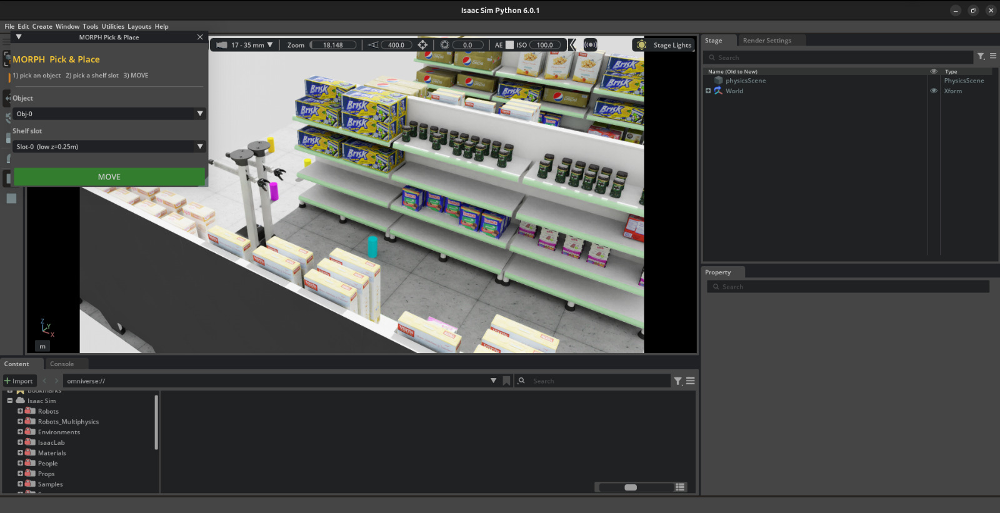

<h1 align="center">MORPH Isaac Sim — Milestone 1</h1>

<p align="center">
  <strong>The MORPH market world and the MORPH-I mobile manipulator, converted from MuJoCo and
  loading correctly in NVIDIA Isaac Sim under PhysX.</strong>
</p>

<p align="center">
  
  
  
  
</p>

<p align="center">
  
</p>

---

## Scope

**Milestone 1 is the assets.** The complete MuJoCo market scene and the 98-DOF robot are converted
to an OpenUSD package that loads, renders and simulates correctly in Isaac Sim.

| In this milestone | Not in this milestone |
| --- | --- |
| MJCF → OpenUSD conversion of the world and the robot | Base navigation / path planning |
| Racks, shelves, textured products, marble floor | Arm motion, IK, trajectories |
| 98-DOF robot articulation, parked and every joint controllable | Grasping, lifting, placing |
| Converter-damage fixups applied at load | Physics tuning for manipulation |

---

## Preview

<p align="center">
  
  &nbsp;
  
</p>

---

## Requirements

* **NVIDIA Isaac Sim 6.0.1** — installed separately, download the
  `isaac-sim-standalone-6.0.1-linux-x86_64` package from
  [NVIDIA's Isaac Sim downloads](https://developer.nvidia.com/isaac-sim).
  This repository is **not** self-contained and Isaac Sim is not pip-installable here.
* RTX-capable NVIDIA GPU + driver, Ubuntu 22.04, ~30 GB free for the Isaac install and its
  first-run shader cache.
* Nothing to `pip install` — `view_and_jog.py` and `scene.py` run inside Isaac Sim's bundled Python,
  which already ships numpy and OpenUSD (`pxr`).

Tested on 6.0.1. Other 6.0.x releases may work; 4.x/5.x will not — the APIs used here moved.

---

## Run it

```bash
cd M1
/path/to/isaac-sim-standalone-6.0.1-linux-x86_64/python.sh view_and_jog.py
```

A window opens with the market world loaded and the robot in it, and the arm and fingers jog
through a small swing so you can see every articulated joint responding. Close the window to exit.

| Variable | Effect |
| --- | --- |
| `ISAAC_HEADLESS=1` | no window — runs the check and exits (CI / verification) |
| `STILL=1` | hold the park pose instead of jogging |
| `JOG_SECONDS=20` | length of the jog (default 15) |

Headless verification:

```bash
ISAAC_HEADLESS=1 /path/to/isaac-sim/python.sh view_and_jog.py
```

It reports how far each joint actually moved and passes or fails on its own:

```
>>> jogging 7 joints
  OK  ColumnLeftBearingJoint_1     moved 0.150 rad
  OK  ArmLeftJoint_1               moved 0.150 rad
  ...
>>> JOG PASS
```

---

## What `scene.py` does at load

The MJCF → USD converter produces a scene that does not simulate correctly as-is. Each problem is
an explicit, commented fixup rather than a silent patch:

| Converter artifact | Fixup |
| --- | --- |
| Static props import as **dynamic** rigid bodies with bad mass and fall through the floor | re-marked static, their redundant world-fixed joints deactivated |
| The MuJoCo `grasp_left*` welds import **active** and snap the products to the gripper | deactivated (`SetActive(False)` — `RemovePrim` fails silently through a payload) |
| MuJoCo's single `<light>` does not convert → RTX renders black | dome + distant sun added |
| Floor marble stretched over the whole 8×8 plane instead of tiling 4×4 | an 8×8 quad authored with the marble tiled 4×4 |
| Link masses missing on import | re-applied from `usd/_link_masses.json` |
| The arm's closed parallel linkage cannot be expressed by the converter | re-authored as a PhysX joint, park pose forced so the arm does not sag into the chassis |

---

## Layout

```
M1/
├── view_and_jog.py          entry point — loads the scene and jogs every articulated joint
├── scene.py                 world assembly + all converter fixups
└── usd/
    ├── market_world_m1/     the converted world (payloads + textures)
    ├── products_textured.usd  12 textured products
    ├── products_tex/        product textures
    ├── _products.json       product placement manifest
    ├── _link_masses.json    per-link masses re-applied at load
    └── _home_keyframe.json  the robot's park pose
```

---

## Troubleshooting

| Symptom | Cause | Fix |
| --- | --- | --- |
| `USD not found: .../market_world_m1.usda` | run from the wrong directory | `cd M1` first, or pass an absolute path |
| `ModuleNotFoundError: isaacsim` | run with system Python | use Isaac Sim's own `python.sh` |
| Scene renders black | running an Isaac version whose lighting API differs | use 6.0.1 |
| Products missing, world otherwise fine | `usd/products_textured.usd` not copied | re-copy the whole `usd/` folder — it is one package |
| Window opens then closes immediately | `ISAAC_HEADLESS=1` still set | unset it |
| `No jog joints matched.` | robot failed to load, so no joint names exist | check the lines above it for a USD/asset error |
